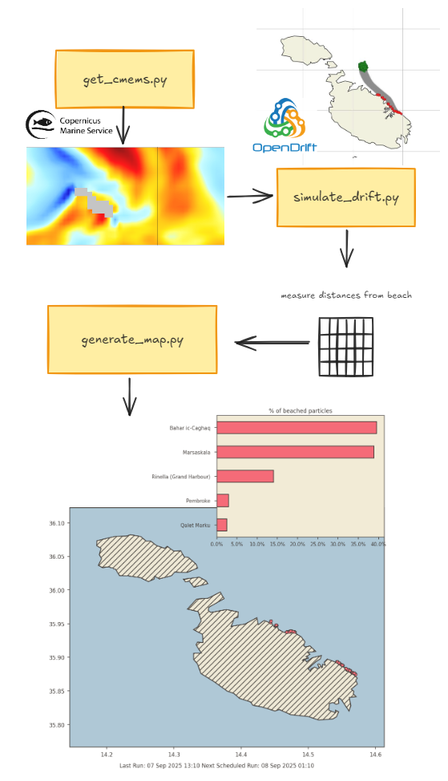

How https://charlesmercieca.github.io/sea-slime-forecast/ is made below!

## Intro

Sometimes, when the conditions are just right, [Malta gets slime from fish farm feed](https://www.maltatoday.com.mt/news/national/136520/aquaculture_industry_pledges_cleaner_seas_after_opposition_raises_slime_concerns). I played enough with OpenDrift on another project to know it can make a lightweight forecast.

## Methodology

This simulation spawns sea slime particles twice daily and assumes they drift with the currents. To get current data, I use CMEMS, specifically their `cmems_mod_med_phy-cur_anfc_4.2km_PT15M-i` product, which I download using `copernicusmarine` `subset`.

A basic 24 hour OceanDrift using OpenDrift is calculated from points spawned on known fish farm locations. Any beached particles are saved and their distance from a csv of known beach lat/lons is calculated.

`generate_map.py` then generates the static map, which is hosted in a basic `index.html` file.

Or, more graphically:

The whole thing is orchestrated thorough a GitHub action that runs twice daily, making for a lightweight deployment. 
